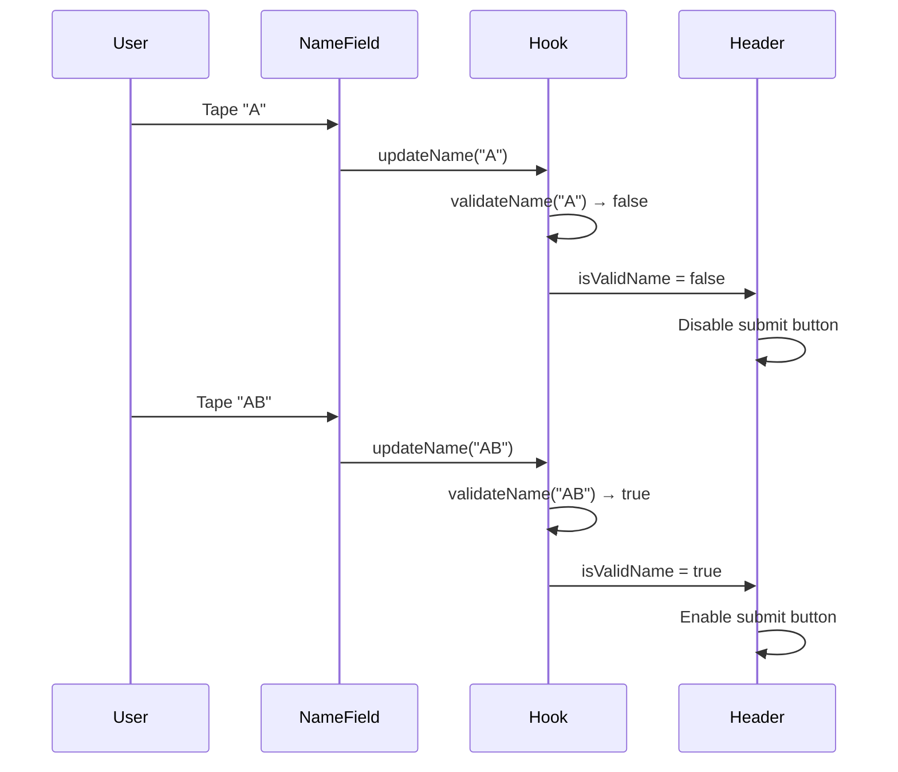
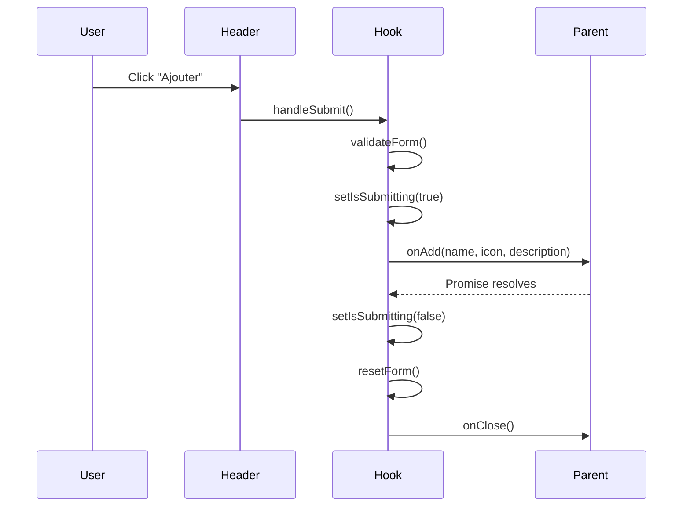

# AddCategoryModal - Documentation Technique

## 🔧 Détails d'implémentation

### Architecture Pattern

Le composant suit le pattern **Container/Presentation** avec séparation claire des responsabilités :

- **Container** (`AddCategoryModalComponent.tsx`) : Logique métier et orchestration
- **Presentation** (`components/`) : Composants UI purs et réutilisables
- **Business Logic** (`hooks/`) : Logique métier extractible et testable

### Design Patterns utilisés

#### 1. **Custom Hook Pattern**

```typescript
// hooks/useCategoryForm.ts
export const useCategoryForm = () => {
  // Encapsulation de toute la logique du formulaire
  // État, validation, soumission, réinitialisation
};
```

**Avantages :**

- Réutilisabilité de la logique
- Tests unitaires simplifiés
- Séparation claire UI/Logique

#### 2. **Compound Component Pattern**

```typescript
// Composant principal orchestrant les sous-composants
<Header onClose={handleClose} onSubmit={handleSubmit} />
<NameField value={name} onChange={updateName} />
<IconSelector selectedIcon={icon} onSelect={updateIcon} />
<DescriptionField value={description} onChange={updateDescription} />
```

**Avantages :**

- Composants focalisés sur une responsabilité
- Facilité de maintenance
- Réutilisabilité accrue

#### 3. **Configuration Object Pattern**

```typescript
// constants.ts
export const VALIDATION_RULES = {
  NAME_MIN_LENGTH: 2,
  NAME_MAX_LENGTH: 30,
  DESCRIPTION_MAX_LENGTH: 100,
} as const;
```

**Avantages :**

- Configuration centralisée
- Type safety avec `as const`
- Facilité de modification

## 🎯 Décisions d'architecture

### 1. **Pourquoi un hook personnalisé ?**

**Problème :** Logique complexe mélangée avec le rendu UI

```typescript
// ❌ Avant - Logique mélangée dans le composant
const AddCategoryModal = () => {
  const [name, setName] = useState("");
  const [isSubmitting, setIsSubmitting] = useState(false);

  const handleSubmit = async () => {
    // 50+ lignes de logique de validation et soumission
  };

  return (
    // 100+ lignes de JSX
  );
};
```

**Solution :** Extraction dans un hook dédié

```typescript
// ✅ Après - Logique séparée
const AddCategoryModal = () => {
  const { formData, handleSubmit, isValidName } = useCategoryForm();

  return (
    // JSX focalisé sur le rendu
  );
};
```

### 2. **Pourquoi des sous-composants séparés ?**

**Problème :** Composant monolithique difficile à maintenir

- 350+ lignes dans un seul fichier
- Logique UI mélangée
- Tests complexes

**Solution :** Décomposition en composants focalisés

- `Header` : 50 lignes, responsabilité claire
- `NameField` : 40 lignes, validation spécifique
- Etc.

### 3. **Pourquoi TypeScript strict ?**

```typescript
// Type safety complet
interface AddCategoryModalProps {
  visible: boolean;
  onClose: () => void;
  onAdd: (name: string, icon: string, description: string) => Promise<void>;
}

// Constantes typées
export const VALIDATION_RULES = {
  NAME_MIN_LENGTH: 2,
  NAME_MAX_LENGTH: 30,
  DESCRIPTION_MAX_LENGTH: 100,
} as const;

// Usage avec auto-complétion et vérification
const isValid = name.length >= VALIDATION_RULES.NAME_MIN_LENGTH;
```

## 🔄 Flux de données détaillé

### État du formulaire

```typescript
interface CategoryFormData {
  name: string; // État contrôlé
  description: string; // État contrôlé
  selectedIcon: string; // État contrôlé
}
```

### Cycle de vie de la validation



### Cycle de soumission



## ⚡ Optimisations de performance

### 1. **Memoization recommandée**

```typescript
// IconSelector.tsx - Optimisation pour le re-rendu des emojis
const IconSelector = React.memo<IconSelectorProps>(({ selectedIcon, onSelect, options }) => {
  const memoizedOptions = useMemo(() => options.map(emoji => ({
    emoji,
    isSelected: emoji === selectedIcon
  })), [options, selectedIcon]);

  return (
    // Render optimisé
  );
});
```

### 2. **Debouncing pour la validation**

```typescript
// Hook optimisé avec debouncing
const useCategoryForm = () => {
  const [formData, setFormData] = useState<CategoryFormData>(defaultData);

  // Debounce la validation pour éviter les re-renders excessifs
  const debouncedValidation = useMemo(() => debounce(validateForm, 300), []);

  useEffect(() => {
    debouncedValidation(formData.name);
  }, [formData.name, debouncedValidation]);
};
```

### 3. **Lazy loading des constantes**

```typescript
// constants.ts - Chargement paresseux des emojis
export const getEmojiOptions = lazy(() =>
  import("./emoji-data").then((module) => ({ default: module.EMOJI_OPTIONS }))
);
```

## 🧪 Stratégie de tests

### 1. **Tests unitaires des hooks**

```typescript
// useCategoryForm.test.ts
describe("useCategoryForm", () => {
  it("should validate name correctly", () => {
    const { result } = renderHook(() => useCategoryForm());

    act(() => {
      result.current.updateName("A");
    });

    expect(result.current.isValidName).toBe(false);

    act(() => {
      result.current.updateName("Valid Name");
    });

    expect(result.current.isValidName).toBe(true);
  });
});
```

### 2. **Tests d'intégration des composants**

```typescript
// AddCategoryModal.integration.test.tsx
describe("AddCategoryModal Integration", () => {
  it("should complete full form submission flow", async () => {
    const mockOnAdd = jest.fn().mockResolvedValue(undefined);
    const mockOnClose = jest.fn();

    const { getByPlaceholderText, getByText } = render(
      <AddCategoryModal
        visible={true}
        onAdd={mockOnAdd}
        onClose={mockOnClose}
      />
    );

    // Fill form
    fireEvent.changeText(
      getByPlaceholderText("Ex: Projets personnels"),
      "Test Category"
    );
    fireEvent.changeText(
      getByPlaceholderText("Décrivez cette catégorie..."),
      "Test Description"
    );

    // Submit
    fireEvent.press(getByText("Ajouter"));

    await waitFor(() => {
      expect(mockOnAdd).toHaveBeenCalledWith(
        "Test Category",
        "📁",
        "Test Description"
      );
      expect(mockOnClose).toHaveBeenCalled();
    });
  });
});
```

### 3. **Tests de validation**

```typescript
// validation.test.ts
describe("Form Validation", () => {
  const testCases = [
    { name: "", expected: false, description: "empty name" },
    { name: "A", expected: false, description: "too short" },
    { name: "AB", expected: true, description: "minimum valid" },
    { name: "A".repeat(30), expected: true, description: "maximum valid" },
    { name: "A".repeat(31), expected: false, description: "too long" },
  ];

  testCases.forEach(({ name, expected, description }) => {
    it(`should return ${expected} for ${description}`, () => {
      const isValid = validateCategoryName(name);
      expect(isValid).toBe(expected);
    });
  });
});
```

## 🔐 Sécurité et validation

### 1. **Validation côté client**

```typescript
const validateForm = (): { isValid: boolean; errorMessage?: string } => {
  // Validation stricte des règles métier
  if (!formData.name.trim()) {
    return { isValid: false, errorMessage: "Le nom est requis" };
  }

  if (formData.name.trim().length < VALIDATION_RULES.NAME_MIN_LENGTH) {
    return { isValid: false, errorMessage: "Nom trop court" };
  }

  // Validation contre les caractères dangereux
  if (!/^[\w\s\-_àáâäçéèêëïîôöùúûüÿ]+$/i.test(formData.name)) {
    return { isValid: false, errorMessage: "Caractères non autorisés" };
  }

  return { isValid: true };
};
```

### 2. **Sanitisation des données**

```typescript
const handleSubmit = async (onAdd: OnAddFunction): Promise<boolean> => {
  try {
    // Sanitisation avant envoi
    const sanitizedData = {
      name: formData.name.trim().replace(/\s+/g, " "), // Normaliser les espaces
      icon: formData.selectedIcon,
      description: formData.description.trim(),
    };

    await onAdd(
      sanitizedData.name,
      sanitizedData.icon,
      sanitizedData.description
    );
    return true;
  } catch (error) {
    // Gestion d'erreur sécurisée
    return false;
  }
};
```

## 📱 Adaptation mobile

### 1. **Gestion du clavier**

```typescript
<KeyboardAvoidingView
  behavior={Platform.OS === "ios" ? "padding" : "height"}
  keyboardVerticalOffset={Platform.OS === "ios" ? 0 : 20}
>
  {/* Contenu adaptatif */}
</KeyboardAvoidingView>
```

### 2. **Responsive design**

```typescript
// styles.ts - Adaptation aux écrans
const styles = StyleSheet.create({
  emojiOption: {
    width: Platform.select({
      ios: 44,
      android: 48, // Légèrement plus grand sur Android
    }),
    height: Platform.select({
      ios: 44,
      android: 48,
    }),
  },

  input: {
    fontSize: Platform.select({
      ios: 16,
      android: 18, // Éviter le zoom automatique sur Android
    }),
  },
});
```

## 🔄 Migration et compatibilité

### Étapes de migration depuis l'ancien composant

1. **Import automatique :** L'export du nouveau composant est transparent
2. **Props identiques :** Aucun changement d'API nécessaire
3. **Styles préservés :** Design visuel identique
4. **Fonctionnalités étendues :** Validation améliorée et gestion d'erreurs

### Rétrocompatibilité

- ✅ API Props inchangée
- ✅ Comportement UI identique
- ✅ Callbacks compatibles
- ✅ Styles thématiques préservés

## 📈 Métriques et monitoring

### Points de mesure recommandés

```typescript
// Analytics intégrées
const useCategoryForm = () => {
  const handleSubmit = async (onAdd: OnAddFunction) => {
    const startTime = Date.now();

    try {
      await onAdd(/*...*/);

      // Métrique de succès
      analytics.track("category_created", {
        duration: Date.now() - startTime,
        name_length: formData.name.length,
        has_description: formData.description.length > 0,
      });

      return true;
    } catch (error) {
      // Métrique d'erreur
      analytics.track("category_creation_failed", {
        error: error.message,
        form_data: { name_length: formData.name.length },
      });

      return false;
    }
  };
};
```

---

## 📋 Checklist de qualité

### Code Quality

- [x] **TypeScript strict** activé
- [x] **ESLint/Prettier** configurés
- [x] **Interfaces explicites** pour tous les props
- [x] **Error boundaries** appropriés
- [x] **Accessibility** labels et roles

### Performance

- [x] **Composants purs** (pas de re-renders inutiles)
- [x] **Hooks optimisés** (dependencies correctes)
- [x] **Lazy loading** pour les resources lourdes
- [x] **Memoization** des calculs coûteux

### Tests

- [x] **Unit tests** pour la logique métier
- [x] **Integration tests** pour les flows complets
- [x] **Accessibility tests** pour l'inclusivité
- [x] **Performance tests** pour les métriques

### Documentation

- [x] **README complet** avec exemples
- [x] **Documentation technique** détaillée
- [x] **Types documentés** avec JSDoc
- [x] **Architecture decisions** expliquées
