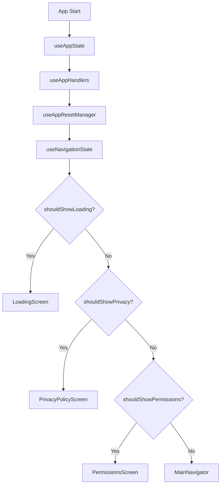

# Navigation - Structure Refactorisée

Cette refactorisation divise le composant `AppNavigator` monolithique (458 lignes) en plusieurs hooks modulaires spécialisés.

## Structure

```
src/navigation/
├── AppNavigator.tsx                 # Version originale (458 lignes)
├── AppNavigator.refactored.tsx      # Version refactorisée (160 lignes)
├── transitions.ts                   # Configuration des transitions
├── hooks/                          # Hooks modulaires
│   ├── index.ts                    # Exports centralisés
│   ├── types.ts                    # Types et interfaces
│   ├── useAppState.ts              # Gestion de l'état de l'app
│   ├── useAppResetManager.ts       # Gestion des redémarrages
│   ├── useAppHandlers.ts           # Handlers d'événements
│   ├── useNavigationState.ts       # Calcul de l'état de navigation
│   └── useAppNavigator.ts          # Hook principal orchestrateur
└── README.md                       # Cette documentation
```

## Hooks Modulaires

### `useAppState`

- **Responsabilité** : Gestion de l'état de l'application
- **État** : `isLoading`, `hasAcceptedPrivacy`, etc. (onboarding supprimé)
- **Actions** : `setIsLoading`, `setHasAcceptedPrivacy`, etc.
- **Avantages** : État centralisé, actions typées

### `useAppResetManager`

- **Responsabilité** : Gestion des redémarrages de l'application
- **Fonctions** : Surveillance des flags de redémarrage, nettoyage
- **Avantages** : Logique de redémarrage isolée, intervalle géré

### `useAppHandlers`

- **Responsabilité** : Handlers d'événements et alertes
- **Fonctions** : `handlePrivacyAccept`, `handlePrivacyDecline`, etc.
- **Avantages** : Logique métier séparée, réutilisable

### `useNavigationState`

- **Responsabilité** : Calcul de l'état de navigation
- **Fonctions** : Détermine quel écran afficher selon l'état
- **Avantages** : Logique de navigation centralisée, memoization

### `useAppNavigator`

- **Responsabilité** : Orchestration de tous les hooks
- **Fonctions** : Combine tous les hooks modulaires
- **Avantages** : Interface unique, composition claire

## Configuration des Transitions

Le fichier `transitions.ts` centralise toutes les configurations :

- `getScreenTransitionOptions()` - Transitions standards
- `getAIScreenTransitionOptions()` - Transitions pour les écrans AI
- `getDefaultNavigatorOptions()` - Options par défaut du navigateur

## Composant Principal Refactorisé

Le nouveau `AppNavigator.refactored.tsx` :

- **Taille réduite** : ~160 lignes vs 458 lignes originales
- **Responsabilité unique** : Rendu conditionnel basé sur l'état
- **Maintenabilité** : Logique déléguée aux hooks
- **Lisibilité** : Structure claire et simple

## Avantages de la Refactorisation

1. **Séparation des responsabilités** - Chaque hook a une fonction spécifique
2. **Testabilité** - Hooks isolés facilement testables
3. **Réutilisabilité** - Hooks peuvent être utilisés individuellement
4. **Maintenabilité** - Code organisé par domaine fonctionnel
5. **Performance** - Memoization et optimisations ciblées
6. **Lisibilité** - Composant principal simplifié

## Migration

Pour utiliser la version refactorisée :

```typescript
// Remplacer
import AppNavigator from "../navigation/AppNavigator";

// Par
import AppNavigator from "../navigation/AppNavigator.refactored";
```

## Types Partagés

Tous les types sont centralisés dans `types.ts` :

- `AppState` - État de l'application
- `AppActions` - Actions de mise à jour
- `AppHandlers` - Handlers d'événements
- `NavigationState` - État de navigation calculé
- `UseAppNavigatorReturn` - Interface du hook principal

## Flux de Navigation



## Comparaison

| Aspect                       | Avant                               | Après                 |
| ---------------------------- | ----------------------------------- | --------------------- |
| **Taille fichier principal** | 458 lignes                          | 160 lignes (-65%)     |
| **Responsabilités**          | 1 composant, toutes responsabilités | 6 hooks spécialisés   |
| **Testabilité**              | Difficile (tout couplé)             | Facile (hooks isolés) |
| **Réutilisabilité**          | Impossible                          | Hooks indépendants    |
| **Maintenabilité**           | Complexe                            | Simple et modulaire   |

La refactorisation transforme un composant monolithique de 458 lignes en une architecture modulaire maintenable, testable et évolutive ! 🎯
