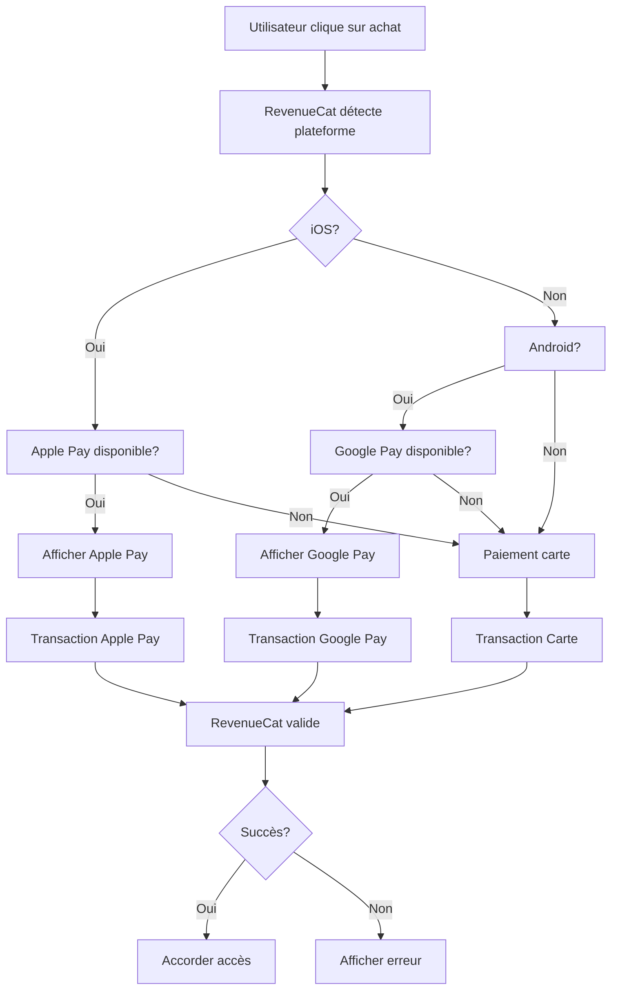

# Utilisation d'Apple Pay / Google Pay avec RevenueCat

## 🚀 Utilisation Simple

```typescript
import revenueCatMobilePay from '../services/subscription/RevenueCatMobilePay';

// 1. Vérifier les méthodes disponibles
const methods = await revenueCatMobilePay.getAvailablePaymentMethods();
console.log(methods);
// { applePay: true, googlePay: false, creditCard: true }

// 2. Effectuer un achat avec le portefeuille mobile
const result = await revenueCatMobilePay.purchaseWithMobileWallet(
  'com.nyth.pro.monthly',
  userId,
  userEmail
);

if (result.success) {
  console.log('✅ Paiement réussi !');
} else {
  console.log('❌ Erreur:', result.error);
}

// 3. Restaurer les achats
const restoreResult = await revenueCatMobilePay.restoreMobilePurchases(userId);
```

## 🔧 Configuration dans RevenueCat

### 1. Dashboard RevenueCat
1. Aller dans **Products**
2. Créer des produits avec Apple Pay / Google Pay activés
3. Dans **Entitlements**, ajouter les droits appropriés

### 2. Identifiants de Produits
```typescript
// Exemples d'identifiants pour Apple Pay
const applePayProducts = {
  'com.nyth.starter.monthly': 'Starter Mensuel',
  'com.nyth.pro.monthly': 'Pro Mensuel',
  'com.nyth.enterprise.monthly': 'Enterprise Mensuel'
};

// Exemples d'identifiants pour Google Pay
const googlePayProducts = {
  'com.nyth.starter.monthly': 'Starter Mensuel',
  'com.nyth.pro.monthly': 'Pro Mensuel'
};
```

### 3. Configuration Technique
RevenueCat gère automatiquement :
- ✅ Détection de la plateforme
- ✅ Configuration Apple Pay / Google Pay
- ✅ Tokenisation sécurisée
- ✅ Validation des achats
- ✅ Restauration des achats

## 🎯 Avantages de cette Approche

| **Avantage** | **Description** |
|-------------|-----------------|
| **Sécurité** | RevenueCat gère toute la tokenisation |
| **Simplicité** | Pas besoin de configurer Stripe/Apple/Google directement |
| **Conformité** | RevenueCat gère les aspects légaux (GDPR, etc.) |
| **Analytics** | Métriques intégrées sur les paiements mobiles |
| **Support** | RevenueCat supporte nativement les portefeuilles mobiles |

## 📱 Intégration dans l'App

### Exemple d'Interface Utilisateur
```typescript
// Composant de sélection de méthode de paiement
const PaymentMethodSelector = () => {
  const [methods, setMethods] = useState(null);

  useEffect(() => {
    revenueCatMobilePay.getAvailablePaymentMethods().then(setMethods);
  }, []);

  if (!methods) return <ActivityIndicator />;

  return (
    <View>
      {methods.applePay && (
        <TouchableOpacity onPress={() => purchaseWithApplePay()}>
          <Text>🍎 Payer avec Apple Pay</Text>
        </TouchableOpacity>
      )}

      {methods.googlePay && (
        <TouchableOpacity onPress={() => purchaseWithGooglePay()}>
          <Text>🤖 Payer avec Google Pay</Text>
        </TouchableOpacity>
      )}

      {methods.creditCard && (
        <TouchableOpacity onPress={() => purchaseWithCreditCard()}>
          <Text>💳 Payer par carte</Text>
        </TouchableOpacity>
      )}
    </View>
  );
};
```

### Gestion des Erreurs
```typescript
// Gestion d'erreur complète
const handlePurchase = async (packageId) => {
  try {
    const result = await revenueCatMobilePay.purchaseWithMobileWallet(packageId, userId);

    if (result.success) {
      navigation.navigate('SuccessScreen');
    } else {
      // Afficher l'erreur à l'utilisateur
      Alert.alert('Erreur', result.error);
    }
  } catch (error) {
    // Erreur réseau ou autre
    Alert.alert('Erreur', 'Problème de connexion');
  }
};
```

## 🔄 Processus de Paiement

### 1. Détection Automatique
```typescript
// RevenueCat détecte automatiquement la méthode appropriée
// iOS → Apple Pay si disponible
// Android → Google Pay si disponible
// Sinon → Paiement par carte
```

### 2. Flux d'Achat


## 📊 Analytics & Monitoring

### Métriques à Surveiller
- **Taux de conversion** par méthode de paiement
- **Temps de transaction** moyen
- **Taux d'abandon** par méthode
- **Revenus** par méthode de paiement

### Logs Importants
```bash
# Filtrer les logs pour les paiements mobiles
grep "MobilePay\|🍎\|🤖" logs.txt

# Vérifier les achats réussis
grep "✅ Achat mobile wallet réussi" logs.txt
```

## 🚨 Dépannage

### Problèmes Courants

#### **Apple Pay non disponible**
- Vérifier que l'appareil a Touch ID/Face ID
- Vérifier que Apple Pay est configuré
- Vérifier les certificats Apple Developer

#### **Google Pay non disponible**
- Vérifier que Google Play Services est à jour
- Vérifier que Google Pay est configuré
- Vérifier les permissions de l'app

#### **Échec de transaction**
- Vérifier la configuration RevenueCat
- Vérifier les identifiants de produit
- Vérifier la connectivité réseau

### Support Technique
1. **Logs RevenueCat** : Activer les logs de debug
2. **Console Apple/Google** : Vérifier les erreurs
3. **Tests en Sandbox** : Utiliser les environnements de test

---

## 🎉 Résumé

**✅ Maintenant FAIT** : Apple Pay / Google Pay intégré avec RevenueCat existant !

**Avantages** :
- 🔒 **Sécurité maximale** (RevenueCat gère la tokenisation)
- ⚡ **Performance optimale** (pas de services supplémentaires)
- 🎯 **Simplicité** (quelques lignes de code)
- 📊 **Analytics intégrés** (métriques de conversion)
- 🛠️ **Maintenance facile** (RevenueCat gère les mises à jour)

**Prochaines étapes** : Dashboard Analytics Avancés !
